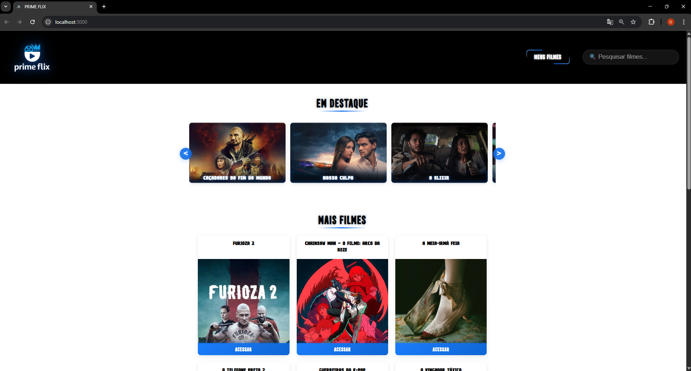
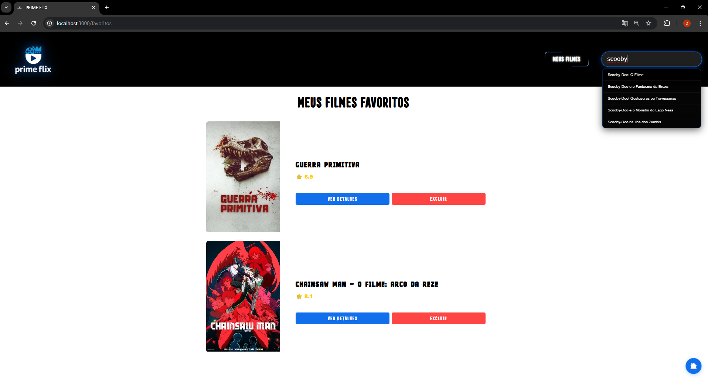
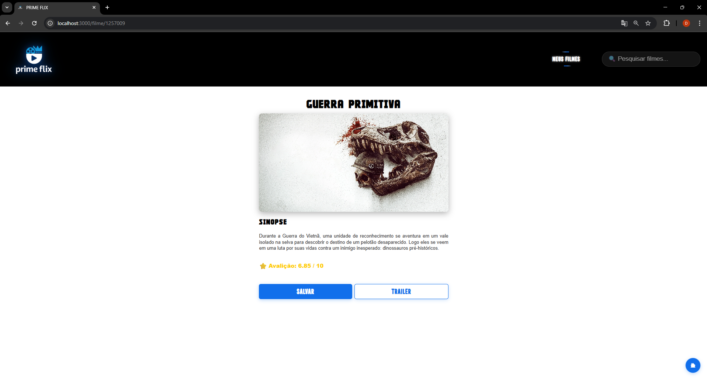

# 🎬 Prime Flix - Plataforma de Catálogo de Filmes  

<div align="center">


</div>

---

## 📸 Visualizações do Projeto  

<div align="center">
  
</div>





---

## ✨ Sobre o Projeto  

**Prime Flix** é uma aplicação web desenvolvida em **React.js** que consome a **API do TMDB (The Movie Database)** para apresentar um catálogo cinematográfico completo e dinâmico.  
O projeto demonstra excelência em desenvolvimento **front-end**, com foco em **experiência do usuário** e **responsividade**.

🎓 Desenvolvido durante o curso:  
> “Projeto Completo NodeJS, React, React Native, TypeScript”  
> Ministrado por **Matheus Fraga | Udemy**

---

## 🚀 Demonstração ao Vivo  

🌐 **Acesse a aplicação:**  
🔗 [https://prime-flix-wheat.vercel.app/](https://prime-flix-wheat.vercel.app/)

---

## 🎨 Funcionalidades Implementadas  

### 🎯 Carrossel Interativo  
- Navegação suave com controles personalizados  
- Scroll horizontal programático usando `useRef`  
- Loading states elegantes com feedback visual  
- Otimização de performance com lazy loading de imagens  

## 📊 Seção de Catálogo Dinâmico
Grid responsivo com layout adaptativo

Paginação inteligente utilizando slice arrays

Cards informativos com posters otimizados

Links dinâmicos para páginas de detalhes

## 🎪 Experiência do Usuário Premium
Design moderno com estética cinematográfica

Feedback visual imediato em todas as interações

Navegação intuitiva entre seções

Performance otimizada com estados de carregamento

## 🛠️ Arquitetura Técnica
### ⚙️ Stack Tecnológico
json
Copiar código
```
{
  "frontend": "React 18+",
  "linguagem": "JavaScript ES6+",
  "estilização": "CSS3 Modules",
  "roteamento": "React Router DOM",
  "consumo": "REST API - TMDB",
  "hooks": "useState, useEffect, useRef",
  "deploy": "Vercel Platform"
}
```
## 🔗 Integração com API TMDB
javascript
```
Copiar código
// Configuração e consumo da API
useEffect(() => {
  async function loadFilmes() {
    const response = await api.get('movie/now_playing', {
      params: {
        api_key: 'chave_api',
        language: 'pt-BR',
        page: 1,
      },
    });
    setFilmes(response.data.results);
    setLoading(false);
  }
  loadFilmes();
}, []);
```
## 🌟 Diferenciais Técnicos
### ⚡ Performance e Otimização
CDN de imagens do TMDB para carregamento rápido

Renderização eficiente com keys únicas e estáveis

Gestão de estado otimizada com useState

Efeitos colaterais controlados com dependências do useEffect

### 🎨 Experiência Visual
Hierarquia visual clara e intuitiva

Tipografia escalável e legível

Paleta de cores temática cinematográfica

Microinterações suaves e profissionais

### 🔧 Qualidade de Código
Princípios Clean Code aplicados

Reutilização de componentes

Minimização de prop drilling

Error handling robusto

---

📊 Métricas e Estatísticas
Aspecto	Detalhes	Impacto
Componentes	5+ componentes reutilizáveis ♻️	Manutenibilidade
Hooks	2 useState + 1 useEffect + 1 useRef	Performance
API Calls	1 endpoint principal otimizado 🚀	Velocidade
Responsividade	3 breakpoints estratégicos 📱	Adaptabilidade
Imagens	CDN TMDB + lazy loading 🖼️	Otimização
🎓 Contexto de Desenvolvimento

“O Prime Flix representa um marco significativo na minha jornada de aprendizado em desenvolvimento front-end.
Mais do que simplesmente implementar funcionalidades, busquei compreender profundamente os conceitos do React.js e as melhores práticas de desenvolvimento web moderno, sempre com foco na experiência do usuário final.”

## 📈 Evolução Técnica Demonstrada

✅ Domínio de React Hooks (useState, useEffect, useRef)

✅ Gestão de Estado local e assíncrono

✅ Consumo de APIs RESTful com tratamento de erros

✅ CSS Responsivo avançado com abordagem Mobile-First

✅ Arquitetura de Componentes modular

✅ Deploy Profissional na Vercel

✅ Otimização de Performance Front-end

## 🎓 Contexto de Desenvolvimento
“O Prime Flix representa um marco significativo na minha jornada de aprendizado em desenvolvimento front-end.
Mais do que simplesmente implementar funcionalidades, busquei compreender profundamente os conceitos do React.js e as melhores práticas de desenvolvimento web moderno, sempre com foco na experiência do usuário final.”

## 📈 Evolução Técnica Demonstrada
✅ Domínio de React Hooks (useState, useEffect, useRef)

✅ Gestão de Estado local e assíncrono

✅ Consumo de APIs RESTful com tratamento de erros

✅ CSS Responsivo avançado com abordagem Mobile-First

✅ Arquitetura de Componentes modular

✅ Deploy Profissional na Vercel

✅ Otimização de Performance Front-end

---

📧 Email: diogocrmaia03@gmail.com

💼 LinkedIn: Diogo Cruz Maia

🐙 GitHub: DioCrM22

🌐 Portfólio: Repositórios GitHub
<div align="center">

⭐️ Se este projeto te impressionou, deixe uma estrela no repositório!

“Do código à experiência: transformando ideias em realidade digital.”

</div>

<div align="center">


</div>
